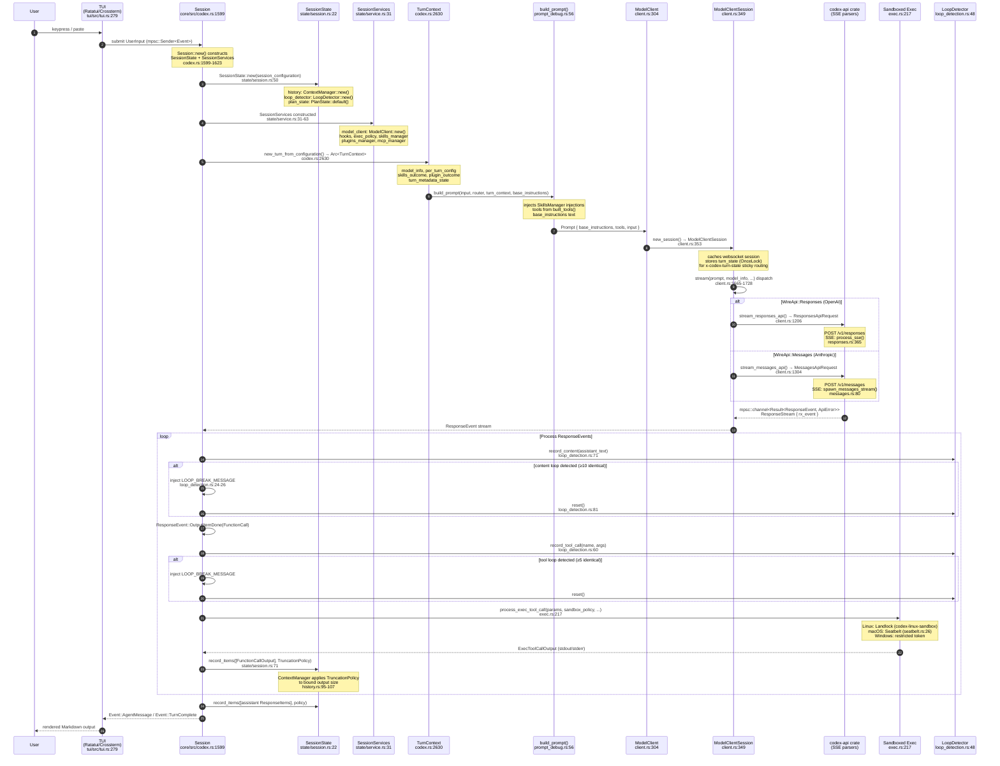
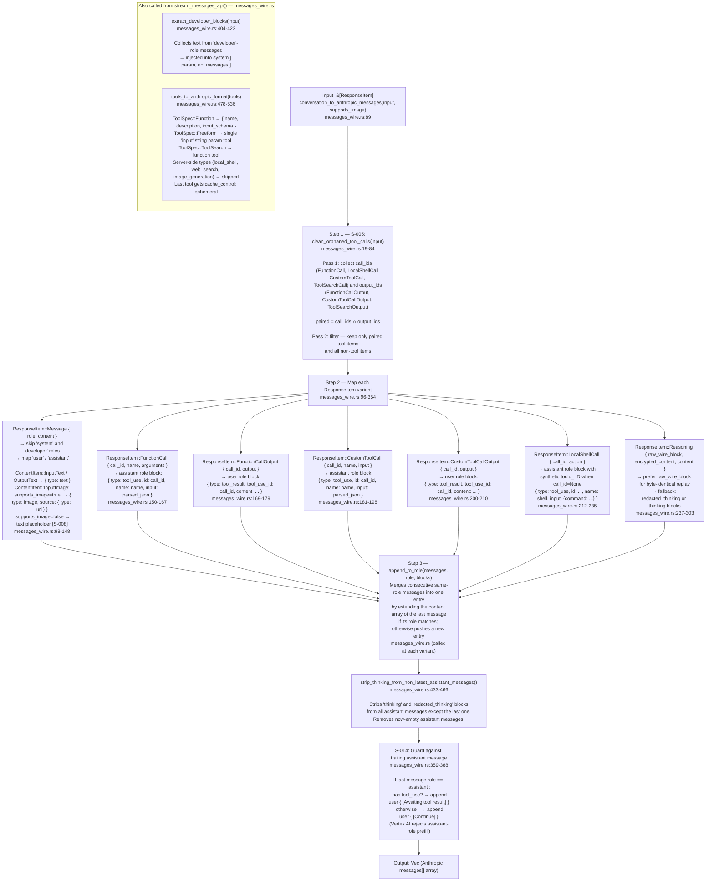

# xli — Turn Lifecycle Architecture

**Subject**: XLI — Universal CLI agent harness (Rust). Speaks OpenAI `/responses` and Anthropic `/messages`.

All claims in this document are traced to actual source files and line ranges in `codex-rs/`.  
No speculation; no interpretation beyond what the code states.

---

## 1. Full Turn Lifecycle — Sequence Diagram

The diagram below traces a complete interactive turn from user input at the TUI through
model invocation, SSE parsing, tool execution, loop detection, and the loop-back for
tool results.

**Source coverage:**
- TUI: `codex-rs/tui/src/tui.rs:279-324`
- Session init: `codex-rs/core/src/codex.rs:1599-1623`
- SessionState init: `codex-rs/core/src/state/session.rs:48-68`
- TurnContext creation: `codex-rs/core/src/codex.rs:2630-2656`
- build_prompt: `codex-rs/core/src/prompt_debug.rs:56-83` (representative call site)
- ModelClient / ModelClientSession: `codex-rs/core/src/client.rs:304-359`
- stream() dispatch: `codex-rs/core/src/client.rs:1665-1728`
- ResponsesAPI SSE: `codex-rs/codex-api/src/sse/responses.rs:365-388`
- Messages SSE: `codex-rs/codex-api/src/sse/messages.rs:80-87`
- Tool execution / sandboxing: `codex-rs/core/src/exec.rs:217-241`
- Loop detection: `codex-rs/core/src/loop_detection.rs:48-121`

---

## 2. Provider Wire Format — Anthropic `/messages` Translation

Shows the complete pipeline inside `conversation_to_anthropic_messages()`
(`codex-rs/core/src/messages_wire.rs:89-391`).

**Source coverage:**
- `clean_orphaned_tool_calls()`: `messages_wire.rs:19-84`
- `conversation_to_anthropic_messages()`: `messages_wire.rs:89-391`
- `append_to_role()`: merges consecutive same-role messages (called throughout `messages_wire.rs`)
- `strip_thinking_from_non_latest_assistant_messages()`: `messages_wire.rs:433-466`
- `extract_developer_blocks()`: `messages_wire.rs:404-423`
- `tools_to_anthropic_format()`: `messages_wire.rs:478-536`

---

## 3. Session State Architecture

Shows the complete state model for a running xli session, grounded in the struct
definitions and their owning modules.

**Source coverage:**
- `SessionState`: `codex-rs/core/src/state/session.rs:22-46`
- `SessionState::new()`: `codex-rs/core/src/state/session.rs:48-68`
- `SessionServices`: `codex-rs/core/src/state/service.rs:31-63`
- `ContextManager`: `codex-rs/core/src/context_manager/history.rs:32`
- `LoopDetector`: `codex-rs/core/src/loop_detection.rs:30-39`
- `PlanState`: `codex-rs/protocol/src/plan_tool.rs` (via `codex_protocol::plan_tool::PlanState`)
- `TruncationPolicy`: `codex-rs/utils/output-truncation/src/lib.rs`

```mermaid
flowchart TD
    subgraph SESSION["Arc&lt;Session&gt; — codex-rs/core/src/codex.rs:1599"]
        direction TB

        subgraph MSTATE["Mutex&lt;SessionState&gt; — state/session.rs:22"]
            direction TB
            SC["session_configuration: SessionConfiguration\n(model, provider, collaboration_mode,\napproval_policy, sandbox_policy, ...)"]
            HIST["history: ContextManager\ncontext_manager/history.rs:34\n\n• items: Vec&lt;ResponseItem&gt; (transcript)\n• token_info: Option&lt;TokenUsageInfo&gt;\n• reference_context_item: Option&lt;TurnContextItem&gt;\n• record_items(items, TruncationPolicy)\n• truncates FunctionCallOutput / CustomToolCallOutput\n  per TruncationPolicy::Tokens(n) budget"]
            RL["latest_rate_limits: Option&lt;RateLimitSnapshot&gt;\n(merged from API response headers)"]
            DEP["dependency_env: HashMap&lt;String, String&gt;\n(MCP dependency environment variables)"]
            MDP["mcp_dependency_prompted: HashSet&lt;String&gt;"]
            PERM["granted_permissions: Option&lt;PermissionProfile&gt;"]
            NULLC["consecutive_null_completions: u32\n(circuit breaker for empty-response spirals)"]
            PREV["previous_turn_settings: Option&lt;PreviousTurnSettings&gt;\n(model switch / realtime handling across turns)"]
            PREWARM["startup_prewarm: Option&lt;SessionStartupPrewarmHandle&gt;\n(WebSocket pre-warmed during session init)"]
            CONN["active_connector_selection: HashSet&lt;String&gt;"]

            subgraph LD["loop_detector: LoopDetector — loop_detection.rs:30"]
                LDT["tool_call_history: VecDeque&lt;(String, u64)&gt;\n(ring buffer, cap=MAX_HISTORY=64)\ntool_loop_threshold: usize = 5\n\nrecord_tool_call(name, args) → bool\ndetects: last 5 entries identical (name+args hash)"]
                LDC["content_hashes: VecDeque&lt;u64&gt;\n(ring buffer, cap=MAX_HISTORY=64)\ncontent_loop_threshold: usize = 10\n\nrecord_content(text) → bool\ndetects: last 10 hashes identical\n\nreset() clears both buffers"]
            end

            subgraph PS["plan_state: PlanState — codex_protocol::plan_tool"]
                PSC["Tracks current plan steps from update_plan tool calls.\nRe-injected as context each turn via build_initial_context().\ncodex.rs:3903-3912"]
            end
        end

        subgraph SVC["SessionServices — state/service.rs:31"]
            direction TB
            MCLI["model_client: ModelClient\nclient.rs:304\n\nSession-scoped. Holds:\n• provider: ModelProviderInfo (wire_api: WireApi)\n• auth_manager: Arc&lt;AuthManager&gt;\n• cached_websocket_session (for sticky routing)\n\nnew_session() → ModelClientSession per turn"]
            HOOKS["hooks: Hooks  (codex_hooks)\n(pre/post-turn lifecycle hooks)"]
            EP["exec_policy: Arc&lt;ExecPolicyManager&gt;\n(controls which shell commands are allowed)"]
            SKILL["skills_manager: Arc&lt;SkillsManager&gt;\n(loads .skills/ directories and injects skill MD)"]
            PLUG["plugins_manager: Arc&lt;PluginsManager&gt;\n(loads plugin manifests for tool augmentation)"]
            MCP["mcp_manager: Arc&lt;McpManager&gt;\nmcp_connection_manager: Arc&lt;RwLock&lt;McpConnectionManager&gt;&gt;\n(MCP server lifecycle and tool routing)"]
            UEM["unified_exec_manager: UnifiedExecProcessManager\n(manages long-running background terminal processes)"]
            MM["models_manager: Arc&lt;ModelsManager&gt;\n(model metadata, capability flags, context window)"]
            NET["network_proxy: Option&lt;StartedNetworkProxy&gt;\nnetwork_approval: Arc&lt;NetworkApprovalService&gt;"]
            AUTH["auth_manager: Arc&lt;AuthManager&gt;\n(OAuth tokens, API key resolution)"]
            ENV["environment: Option&lt;Arc&lt;Environment&gt;&gt;\n(codex-exec-server Environment for sandboxed exec)"]
            SDB["state_db: Option&lt;StateDbHandle&gt;\n(rollout / persistence layer)"]
        end
    end

    SESSION --> WIRE["Wire dispatch — client.rs:1665-1728\n\nWireApi::Responses → stream_responses_api()\n  → ResponsesApiRequest\n  → POST /v1/responses\n  → SSE: process_sse() (responses.rs:365)\n\nWireApi::Messages → stream_messages_api()\n  → MessagesApiRequest\n  → POST /v1/messages\n  → SSE: spawn_messages_stream() (messages.rs:80)\n\nBoth → mpsc::channel → ResponseStream { rx_event }"]

    SESSION --> SBX["Sandboxed Exec — exec.rs:217\n\nprocess_exec_tool_call(\n  params, sandbox_policy,\n  file_system_sandbox_policy,\n  network_sandbox_policy, ...)\n\nmacOS  → Seatbelt  (seatbelt.rs:26)\nLinux  → Landlock  (linux-sandbox)\nWindows → restricted token"]
```

---

## Source File Index

| Concept | File | Lines |
|---|---|---|
| `SessionState` struct | `codex-rs/core/src/state/session.rs` | 22–46 |
| `SessionState::new()` | `codex-rs/core/src/state/session.rs` | 48–68 |
| `SessionServices` struct | `codex-rs/core/src/state/service.rs` | 31–63 |
| `LoopDetector` struct | `codex-rs/core/src/loop_detection.rs` | 30–39 |
| `LoopDetector::new()` | `codex-rs/core/src/loop_detection.rs` | 48–57 |
| `DEFAULT_TOOL_LOOP_THRESHOLD = 5` | `codex-rs/core/src/loop_detection.rs` | 14 |
| `DEFAULT_CONTENT_LOOP_THRESHOLD = 10` | `codex-rs/core/src/loop_detection.rs` | 17 |
| `MAX_HISTORY = 64` | `codex-rs/core/src/loop_detection.rs` | 21 |
| `ContextManager` struct | `codex-rs/core/src/context_manager/history.rs` | 34 |
| `ContextManager::record_items()` | `codex-rs/core/src/context_manager/history.rs` | 96–107 |
| `TUI` struct (Ratatui) | `codex-rs/tui/src/tui.rs` | 279–299 |
| `Session::new()` | `codex-rs/core/src/codex.rs` | 1599–1623 |
| `new_turn_from_configuration()` | `codex-rs/core/src/codex.rs` | 2630–2656 |
| `ModelClient::new()` | `codex-rs/core/src/client.rs` | 304–347 |
| `ModelClient::new_session()` | `codex-rs/core/src/client.rs` | 349–359 |
| `ModelClientSession::stream()` dispatch | `codex-rs/core/src/client.rs` | 1665–1728 |
| `stream_responses_api()` | `codex-rs/core/src/client.rs` | 1206–1260 |
| `stream_messages_api()` | `codex-rs/core/src/client.rs` | 1304–1414 |
| `process_sse()` (Responses SSE) | `codex-rs/codex-api/src/sse/responses.rs` | 365–388 |
| `spawn_messages_stream()` (Messages SSE) | `codex-rs/codex-api/src/sse/messages.rs` | 80–87 |
| `clean_orphaned_tool_calls()` | `codex-rs/core/src/messages_wire.rs` | 19–84 |
| `conversation_to_anthropic_messages()` | `codex-rs/core/src/messages_wire.rs` | 89–391 |
| `extract_developer_blocks()` | `codex-rs/core/src/messages_wire.rs` | 404–423 |
| `tools_to_anthropic_format()` | `codex-rs/core/src/messages_wire.rs` | 478–536 |
| `process_exec_tool_call()` | `codex-rs/core/src/exec.rs` | 217–241 |
| `spawn_command_under_seatbelt()` | `codex-rs/core/src/seatbelt.rs` | 26–41 |
